# GAMES 106

## Homework 1

### 作业要求
1. 作业要求的gltf文件已经上传到了data/buster_drone/busterDrone.gltf
2. 支持gltf的骨骼动画。
3. 支持gltf的PBR的材质，包括法线贴图。
4. 必须在homework1的基础上做修改，提交其他框架的代码算作不合格。
5. 进阶作业：增加一个Tone Mapping的后处理pass。增加GLTF的滤镜功能。tonemap选择ACES实现如下。这个实现必须通过额外增加一个renderpass的方式实现。
```c++
// tonemap 所使用的函数
float3 Tonemap_ACES(const float3 c) {
    // Narkowicz 2015, "ACES Filmic Tone Mapping Curve"
    // const float a = 2.51;
    // const float b = 0.03;
    // const float c = 2.43;
    // const float d = 0.59;
    // const float e = 0.14;
    // return saturate((x*(a*x+b))/(x*(c*x+d)+e));

    //ACES RRT/ODT curve fit courtesy of Stephen Hill
	float3 a = c * (c + 0.0245786) - 0.000090537;
	float3 b = c * (0.983729 * c + 0.4329510) + 0.238081;
	return a / b;
}
```

## Vulkan SDK

略，太复杂了

## glTF

根据 gltf20-reference-guide.pdf，glTF 全称 GL Transmission Format（glTF 2.0），核心是 JSON 文件，描述了包含 3D 模型的场景的结构。文件中自上而下的元素是：
1. `scenes`，`nodes`：场景的基本结构
2. `cameras`：场景的视图配置（不就是摄像头的参数么）
3. `meshes`：3D 对象的几何信息
4. `buffers`，`bufferViews`，`accessors`：数据引用和数据布局描述符
5. `materials`：物体绘制方式的定义
6. `textures`，`images`，`samplers`：物体的表面外观
7. `skins`：顶点蒙皮信息
8. `animations`：属性随时间的变化

这些信息存储在数组中。对象之间的引用关系通过查找对象在数组中的下标而建立。可以将整个资产存储在单个 glTF 文件中。这种情况下，JSON 数据存储为一个字符串，然后附着缓冲区或者图像的二进制数据。

### 基本概念
glTF 资产顶层元素之间的概念关系如下:
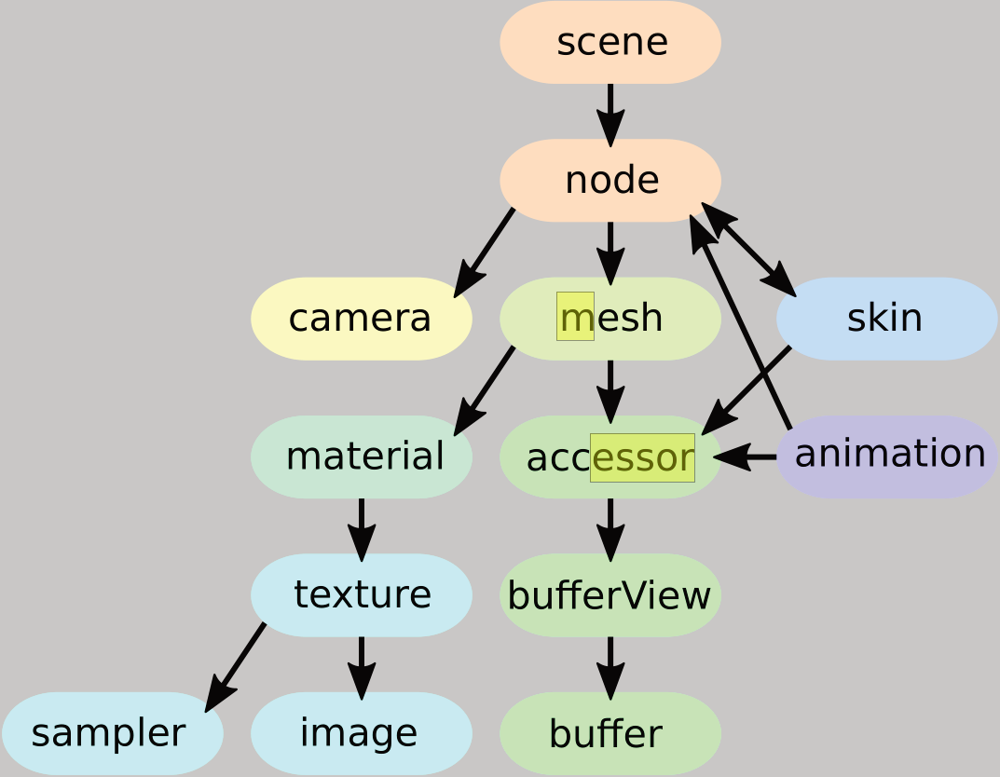

#### 二进制图像索引：
   glTF 资源的图像和缓冲区可以引用包含渲染 3D 对象所需的外部文件数据：
   ```JSON
    "buffers": [
        {
            "uri": "buffer01.bin"
            "byteLength": 102040,
        }
    ],
    "images": [
        {
            "uri": "image01.png"
        }
    ],
   ```
   `buffers` 指向包含几何或动画数据的二进制文件（.bin)，`images` 指向包含纹理数据或者模型的图像数据（.jpg，.png 等）。数据通过 URI 引用，也可将 数据 URI 直接包含在 JSON 文件中。数据 URI 定义了 MIME 类型，并将数据存储为 base64 编码的字符串：
   + 缓冲区数据：`"data:application/gltf-buffer;base64,AAABAAIAAgA..."`
   + 图像数据：`"data:image/png;base64,iVBORw0K..."`

### 场景（`scenes`）和节点（`nodes`）

glTF JSON 文件可能包含**场景**（可选的默认定义为 `scene`）。每个场景可能包含一个节点索引数组。
```JSON
"scene": 0,
"scenes": [
    {
        "nodes": [ 0, 1, 2 ]
    }     //       |
],        //      /
"nodes": [//     /
    {     //    V
        "children": [ 3, 4 ],
        ... //        |  |
    },      //        |  |
    { ... },//        |  |
    { ... },//        |  |
    { ... },// <------|  |
    { ... },// <---------|
    ...
],
```

每个**节点**可以包含其子节点的索引数组，并构建一个简单的场景层次结构：
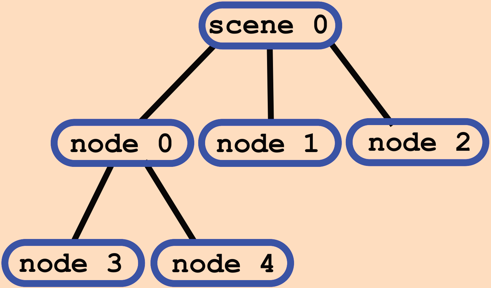

```JSON
"nodes": [
    {
        "matrix": [
            1,0,0,0,
            0,1,0,0,
            0,0,1,0,
            5,6,7,1
        ],
        ...
    },
    {
        "translation":
            [ 0,0,0 ],
        "rotation":
            [ 0,0,0,1 ],
        "scale":
            [ 1,1,1 ]
        ...
    },
]
```

节点可以包含局部变换。作为列主顺序的矩阵数组给出，或者具有单独的平移、旋转和缩放属性，其中旋转给出的是四元数形式。局部变换矩阵是
$$M = T * R * S,$$
其中 $T$，$R$ 和 $S$ 是来自于平移、旋转和缩放的矩阵。节点的全局变换由从根节点到对应节点的路径上所有局部变换的乘积给出。

每个节点可以引用一个曲面模型或一个摄像机，使用指向曲面和摄像机数组的索引。然后将元素附加到节点上。渲染时创建元素的对象，并使用节点的全局变换对其进行变换。
```JSON
"nodes": [
    {
        "mesh": 4,
        ...
    },
    {
        "camera": 2,
        ...
    },
]
```

节点的平移、旋转和缩放属性也可能是动画的目标：动画描述一个属性如何随时间变化。附加的对象将相应地移动，允许模型移动物体或摄像机飞行。

节点也用于顶点蒙皮：节点层次结构可以定义动画角色的骨架。节点随后指向一个网格和一个蒙皮。蒙皮包含网格如何基于当前骨架姿势变形的进一步信息。

### 网格，曲面（`meshes`）

**曲面**可能包含多个网格**原语**（primitives），指的是渲染网格所需的几何数据。

```JSON
"meshes": [
    {
        "primitives": [
            {
                "mode": 4,
                "indices": 0,
                "attributes": {
                    "POSITION": 1,
                    "NORMAL": 2
                },
                "material": 2
            }
        ]
    }
],
```

每个网格原语都有一个渲染**模式**（mode），这是一个常量，表示应该渲染为 `POINTS`、`LINES` 还是 `TRIANGLES`。该原语还使用该数据的访问器的索引引用顶点的**索引**（indices）和**属性**（attributes）。应该用于渲染的**材质**（material）由材质的索引给出。

通过将属性名称映射到包含属性数据的访问器的索引来定义每个属性。这些数据将被用作渲染网格时的顶点属性。例如，这些属性可以定义顶点的 `POSITION` 和 `NORMAL`：
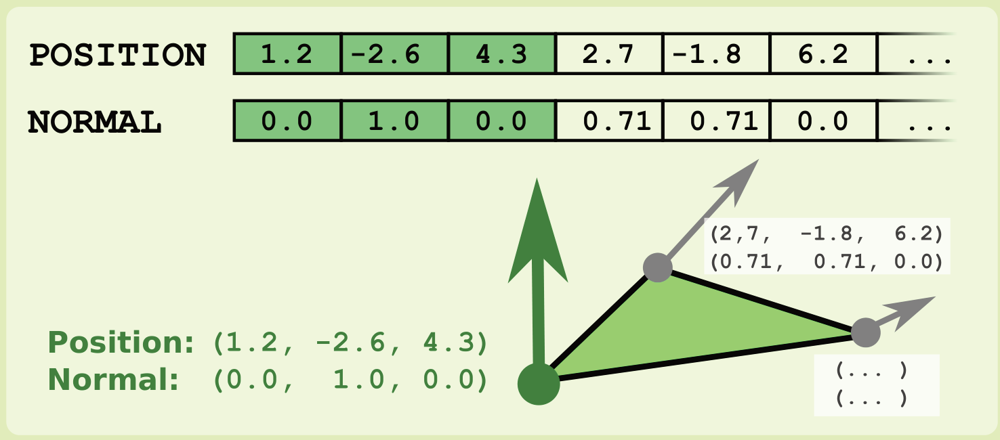

一个网格可以定义多个变形目标。这种变形目标描述了原始网格的变形。
```JSON
{
    "primitives": [
        {
            ...
            "targets": [
                {
                    "POSITION": 11,
                    "NORMAL": 13
                },
                {
                    "POSITION": 21,
                    "NORMAL": 23
                }
            ]
        }
    ],
    "weights": [0, 0.5]
}
```

要定义具有变形目标的网格，每个网格原语可以包含一个**目标**（targets）数组。这些是将属性名称映射到包含目标几何置换的访问器索引的字典。

网格也可能包含一组**权重**（weights），这些权重定义了每个变形目标对网格最终呈现状态的贡献。例如，将不同权重的多个变形目标组合在一起，就可以对角色的不同面部表情进行建模：权重可以通过动画进行修改，以便在不同的几何状态之间插值。

### 缓冲区（`buffers`），缓冲区视图（`bufferViews`）和访问器（`accessors`）

缓冲区包含用于 3D 模型的几何形状、动画和蒙皮制作的数据。缓冲区视图为这些数据添加结构性信息。访问器定义了数据的确切类型和布局。

```JSON
"buffers": [
    {
        "byteLength": 35,
        "uri": "buffer01.bin"
    }
],
```

每个缓冲区都使用 URI 指向一个二进制数据文件。它是一个具有给定 `byteLength` 的原始数据块的来源。

```JSON
"bufferViews": [
    {
        "buffer": 0, // 指向上一个代码的 buffer
        "byteOffset": 4,
        "byteLength": 28,
        "byteStride": 12,
        "target": 34963
    }
],
```

每个**缓冲视图**（`bufferViews`）指的是一个缓冲区。它有一个**字节偏移**（`byteOffset`）和一个**字节长度**（`byteLength`），定义了属于缓冲区视图的缓冲区，还有一个可选的 OpenGL 缓冲区**目标**（`target`）。

```JSON
"accessors": [
    {
        "bufferView": 0,    // 这里指向上一个代码的 bufferView
        "byteOffset": 4,
        "type": "VEC2",
        "componentType": 5126,
        "count": 2,
        "min" : [0.1, 0.2]
        "max" : [0.9, 0.8]
    }
]
```

这些**访问器**（`accessors`）定义了如何解释缓冲区的数据。它们可以定义一个额外的**字节偏移**（`byteOffset`），指的是缓冲区的开始，并包含关于缓冲区数据的类型和布局的信息。

例如，当类型为 `VEC2` 且成分类型为 `GL_FLOAT`（5126）时，数据可被定义为浮点数的二维矢量。所有数值的范围都存储在**最小**（`min`）和**最大**（`max`）属性中。

多个访问器的数据可以在一个缓冲区内交替使用。在这种情况下，`bufferView` 会有一个 `byteStride` 属性，说明一个访问器的一个元素的开始和下一个元素的开始之间有多少字节。

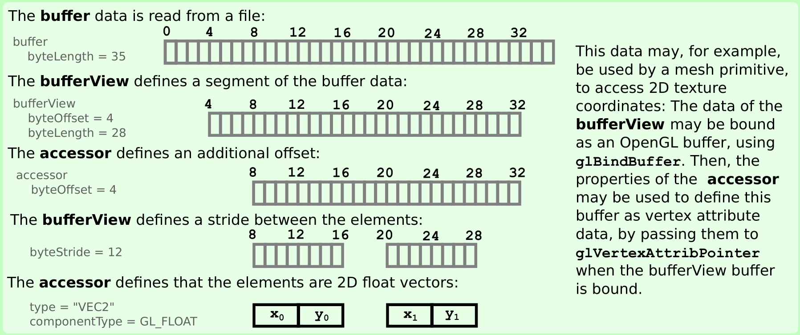

### 稀疏访问器

当访问器中只有少数元素与默认值不同时（常发生在形态对象中），可以使用稀疏的数据描述以非常紧凑的形式给出数据：
```JSON
"accessors": [
    {
    "type": "SCALAR",
    "componentType": 5126,
    "count": 10,
    "sparse": {
        "count": 4,
        "values": {
            "bufferView": 2,
        },
        "indices": {
            "bufferView": 1,
            "componentType": 5123
        }
        }
    }
]
```

访问器定义了数据类型（这里是标量浮点值），以及元素**总数**（`count`）。``sparse` 数据块包含稀疏数据元素的**计数**（`count`）。`values` 指的是包含稀疏数据值的**缓冲区视图**（bufferView）。稀疏数据值的目标**索引**（`indices`）是通过对缓冲区视图和组件类型（`componentType`）的引用定义的。

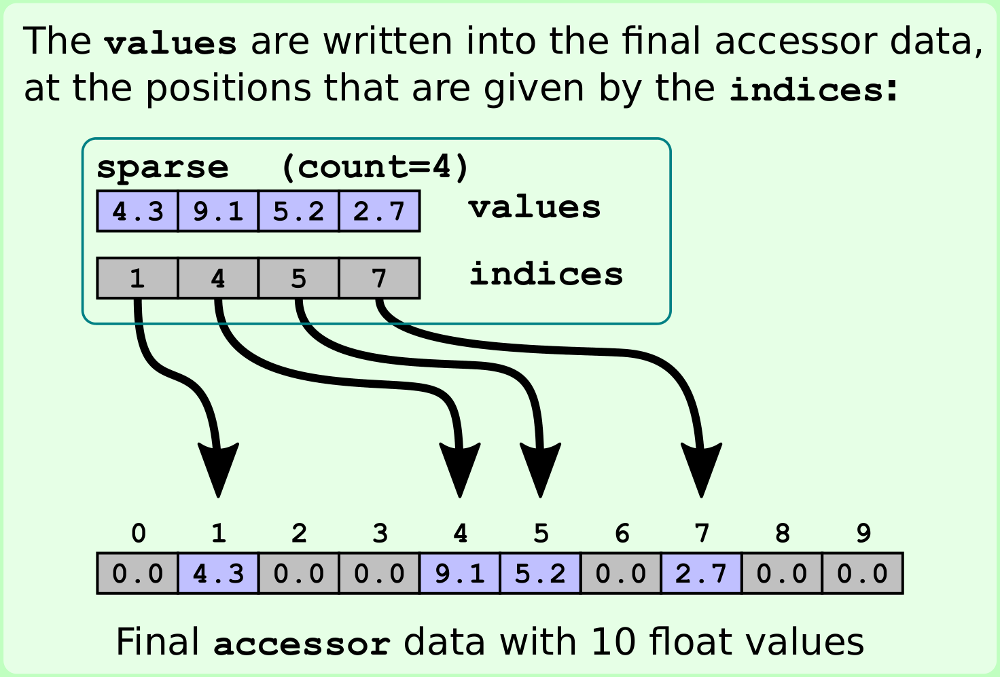

### 材质（`materials`）

每个网格基元都可以引用 glTF 资产中包含的一个材质。这些材质基于物理材质属性，描述了一个物体应该如何被渲染。这允许应用基于物理的渲染（Physically Based Rendering，PBR）技术，以确保渲染对象的外观在所有渲染器中都是一致的。

默认的材料模型是 Metallic-Roughness-Model。0.0 和 1.0 之间的值用来描述材料特性与金属的相似程度，以及物体表面的粗糙程度。这些属性既可以作为适用于整个物体的单独数值，也可以从纹理中读取。

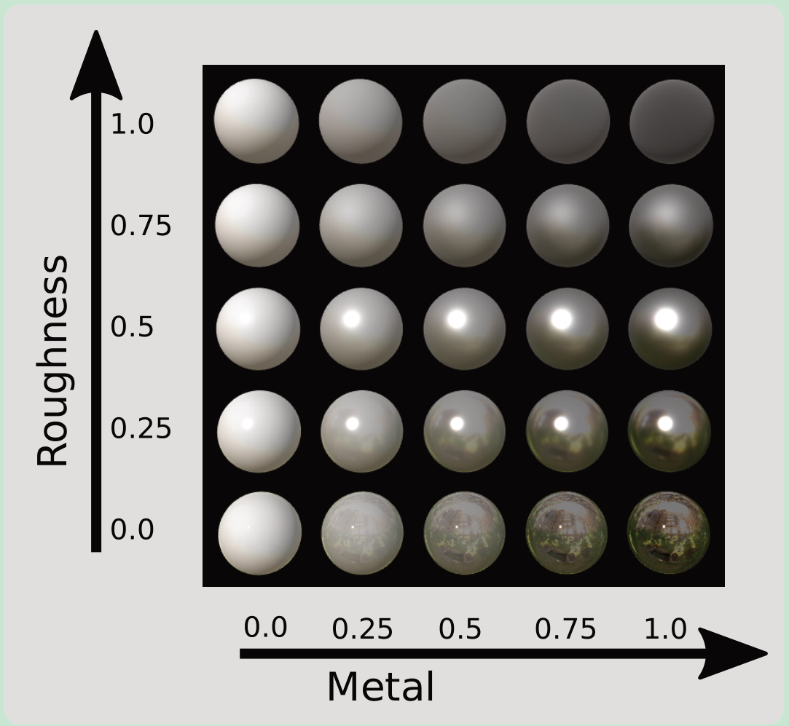

```JSON
"materials": [
    {
        "pbrMetallicRoughness": {
            "baseColorTexture": {
                "index": 1,
                "texCoord": 1
            },
            "baseColorFactor":
                [ 1.0, 0.75, 0.35, 1.0 ],
            "metallicRoughnessTexture": {
                "index": 5,
                "texCoord": 1
            },
            "metallicFactor": 1.0,
            "roughnessFactor": 0.0,
        }
        "normalTexture": {
            "scale": 0.8,
            "index": 2,
            "texCoord": 1
        },
        "occlusionTexture": {
            "strength": 0.9,
            "index": 4,
            "texCoord": 1
        },
        "emissiveTexture": {
            "index": 3,
            "texCoord": 1
        },
        "emissiveFactor":
            [0.4, 0.8, 0.6]
    }
],
```

`pbrMetallicRoughness` 对象中总结了在 Metallic-Roughness-Model 中定义一个材质属性：

`baseColorTexture` 是将应用于对象的主要纹理。`baseColorFactor` 包含了颜色的红、绿、蓝和 alpha 分量的缩放系数。如果没有使用纹理，这些值将定义整个对象的颜色。

`metallicRoughnessTexture` 包含“`blue`”颜色通道的金属度值，以及“`green`” 颜色通道的粗糙度值。`MetallicFactor` 和 `roughnessFactor` 与这些值相乘。如果没有给出纹理，那么这些因子就定义了整个物体的反射特性。

除了通过 Metallic-Roughness-Model 定义的属性外，材料还可能包含其他影响物体外观的属性：
+ `normalTexture` 指的是一个包含切线空间法线信息的纹理，以及一个将应用于这些法线的比例因子（`scale`）。
+ 遮挡纹理（`occlusionTexture`）指的是定义表面上被光遮挡的区域的纹理，因此渲染起来比较暗。这个信息包含在纹理的“`red`”通道中。遮挡强度是应用于这些值的一个缩放系数。
+ `emissiveTexture` 指的是可以用来照亮物体表面部分的纹理：它定义了从表面发射出来的光的颜色。`emissiveFactor` 包含这个纹理的红、绿、蓝分量的缩放系数。

```JSON
"meshes": [
    {
        "primitives": [
            {
                "material": 2,      // 指向下一个代码的材质
                "attributes": {
                    "NORMAL": 3,
                    "POSITION": 1,
                    "TEXCOORD_0": 2,
                    "TEXCOORD_1": 5
                },
            }
        ]
    }
],
```

```JSON
"materials": [
    ...
    {
        "name": "brushed gold",
        "pbrMetallicRoughness": {
            "baseColorFactor":
                [1,1,1,1],
            "baseColorTexture": {
                "index" : 1,        // 指向下一个代码的纹理
                "texCoord" : 1      // 指向上一个代码的 TEXCOORD_1
            },
            "metallicFactor": 1.0,
            "roughnessFactor": 1.0
        }
    }
],
```

```JSON
"textures": [
    ...
    {
        "source": 4,
        "sampler": 2
    }
],
```

材质中的纹理引用总是包含纹理的索引。它们也可能包含 `texCoord` 集合索引。这是一个数字，决定了包含此纹理坐标的渲染网格单元 `TEXCOORD_<n>` 属性，默认为 0。


### 摄像机（`camera`）、纹理（`textures`），图像（`images`）与采样器（`samplers`）、蒙皮（`skins`）

#### 摄像机 `camera`

每个节点指向定义在 glTF 资产中的摄像机之一。

```JSON
"cameras": [
    {
        "type": "perspective",
        "perspective": {
            "aspectRatio": 1.5,
            "yfov": 0.65,
            "zfar": 100,
            "znear": 0.01
        }
    },
    {
        "type": "orthographic",
        "orthographic": {
            "xmag": 1.0,
            "ymag": 1.0,
            "zfar": 100,
            "znear": 0.01
        }
    }
]
```

有两种类型的摄像机：透视（`perspective`）和正交（`orthographic`），定义了投影矩阵。

透视摄像机的远视切平面的距离 `zfar` 是可选的。忽略时摄像机使用特殊的投影矩阵进行无限远的投影。

当其中一个节点指向一个摄像机时，就会创建这个摄像机的一个实例。这个实例的摄像机矩阵由该节点的全局变换矩阵给出。

#### 纹理、图像和采样器

纹理（`textures`） 包含应用在渲染对象上的纹理信息：材质通过纹理定义对象的基本颜色和影响对象外观的物理属性。

```JSON
"textures": [
    {
        "source": 4,    // 指向后一份代码的 images 的 uri
        "sampler": 2    // 指向后两份代码的 samplers
    }
    ...
],
```

```JSON
"images": [
    ...
    {
        "uri": "file01.png"
    }
    {
        "bufferView": 3,
        "mimeType" :
            "image/jpeg"
    }
],
```

```JSON
"samplers": [
    ...
    {
        "magFilter": 9729,
        "minFilter": 9987,
        "wrapS": 10497,
        "wrapT": 10497
    }
},
```

纹理包括对纹理源（`source`）的引用，也就是资产的一个图像（`images`），以及对采样器的引用（`sampler`）。

图像（`images`）定义了用于纹理的图像数据。这个数据可以通过一个 `URI` 给出，这个URI是一个图像文件的位置，或者通过对一个缓冲视图（`bufferView`）的引用和一个 `MIME 类型` 来定义存储在缓冲视图中的图像数据的类型。

采样器（`samplers`）描述了纹理的包裹和缩放。(常量值对应于OpenGL常量，可以直接传递给 `glTexParameter`）。

### 蒙皮

glTF 资产可能包含必须的顶点蒙皮的信息。通过顶点蒙皮，可以让网格的顶点根据其当前的姿势，受到骨架的骨骼的影响。

```JSON
"nodes": [
    {
        "name" :
            "Skinned mesh node",
        "mesh": 0   // 指向后两份代码的 `meshes` 中第一个位置
        "skin": 0,  // 指向后一份代码中 `skins` 中第一个位置
    },
    ...
    {
        "name": "Torso",
        "children":
            [ 2, 3, 4, 5, 6 ]   // 6 指向后续的 "LegL" 所在的节点
        "rotation": [...],
        "scale": [ ...],
        "translation": [...]
    },
    ...
    {
        "name": "LegL",
        "children": [ 7 ],      // 7 指向后续的 "FootL" 所在的节点
        ...
    },
    ...
    {
        "name": "FootL",
        ...
    },
    ...
],
```

```JSON
"skins": [
    {
        "inverseBindMatrices": 12,
        "joints": [ 1, 2, 3 ... ]
    }
],
```

```JSON
"meshes": [
    {
        "primitives": [
            {
                "attributes": {
                    "POSITION": 0,
                    "JOINTS_0": 1,
                    "WEIGHTS_0": 2
                    ...
                }
            },
        ]
    }
],
```

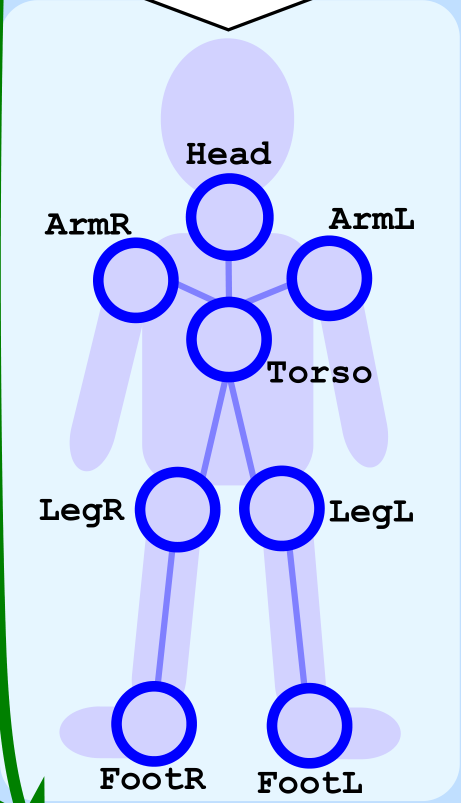

皮肤（`skins`）包含一个关节（`joints`）数组，它是定义骨架层次结构的节点的索引，以及 `inverseBindMatrices`，它是对一个访问器的引用，该访问器包含每个关节的一个矩阵。

骨架的层次结构是用节点建模的，就像场景结构一样：每个关节节点可以有一个局部变换和一个子节点数组，骨架的“骨头”是隐含的，用于连接关节。

换肤后的网格图元包含了指向顶点位置访问器的 `POSITION` 属性，以及两个蒙皮所需的特殊属性：一个 `JOINTS_0` 和一个 `WEIGHTS_0` 属性，分别指向一个访问器。

`JOINTS_0` 属性数据包含应该影响顶点的关节索引。`WEIGHTS_0` 属性数据定义了表示关节应该对顶点产生多大影响的权重。

根据这些信息可以计算蒙皮矩阵（`skinning matrix`）。具体的解释在 `Computing the skinning matrix` 中。


### 计算蒙皮矩阵

蒙皮矩阵描述了曲面的顶点如何基于骨骼姿势进行变换。蒙皮矩阵是关节矩阵的加权组合。

#### 计算关键矩阵

蒙皮指的是 `inverseBindMatrices`。这是一个访问器，包含了每个关节的一个反向绑定矩阵。这些矩阵中的每一个都将网格转换到关节的局部空间。

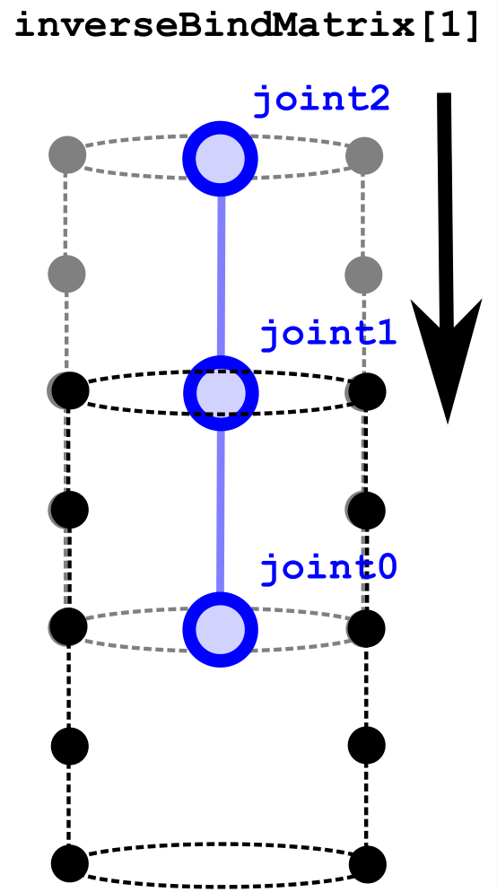

对于索引出现在皮肤关节（`joints`）中的每个节点，可以计算出一个全局变换矩阵。它根据关节的当前全局变换，从关节的局部空间对网格进行变换，称为 `globalJointTransform`。

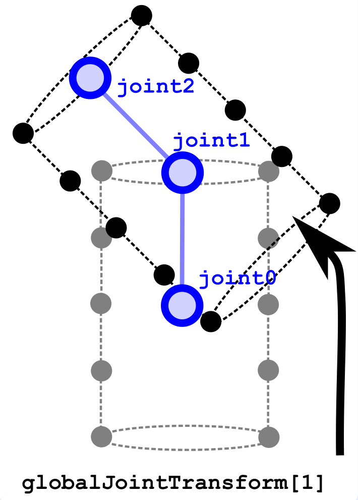

对于这些矩阵，每个关节的 `jointMatrix` 计算方法如下：
```cpp
jointMatrix[j] = inverse(globalTransform) * globalJointTransform[j] * inverseBindMatrix[j];
```

包含网格和皮肤的节点的任何全局变换都会通过预先将联合矩阵与该变换的逆值相乘而被抵消掉。

对于基于 OpenGL 或 WebGL 的实现，`jointMatrix` 数组将作为一个统一体传递给顶点着色器。

#### 结合关节矩阵创建蒙皮矩阵

蒙皮网格的基元包含 `POSITION`、 `JOINT` 和 `WEIGHT` 属性，指的是访问器。这些访问器为每个顶点包含一个元素：
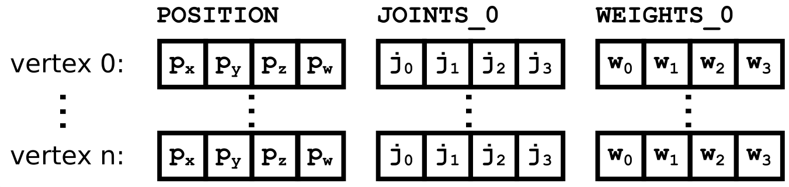

这些访问器的数据与 `jointMatrix` 数组一起作为属性传递给顶点着色器。

```glsl
uniform mat4 u_jointMatrix[12];
attribute vec4 a_position;
attribute vec4 a_joint;     // 对应下图红色部分
attribute vec4 a_weight;    // 对应下图黄色部分
...
void main(void) {
    ...
    mat4 skinMatrix =
    a_weight.x * u_jointMatrix[int(a_joint.x)] +
    a_weight.y * u_jointMatrix[int(a_joint.y)] +
    a_weight.z * u_jointMatrix[int(a_joint.z)] +
    a_weight.w * u_jointMatrix[int(a_joint.w)];
    gl_Position = modelViewProjection * skinMatrix * position;
}
```

`skinMatrix` 在顶点着色器中进行计算。它是关节矩阵的线性组合，其指数包含在 `JOINTS_0` 属性中，用 `WEIGHTS_0` 值加权。

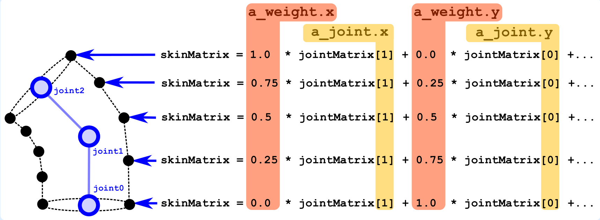

`skinMatrix` 基于骨架姿势对顶点进行转换，然后再用模型-视图-视角矩阵进行变换。


### 动画（`animations`）

glTF 资产可以包括动画（`animations`）。一个动画可以应用在定义节点局部变换的节点上，或者应用在多模态目标的权重上。

```JSON
"animations": [
    {
        "channels": [
            {
                "target": {
                    "node": 1,
                    "path": "translation"
                },
                "sampler": 0    // 指向下面 "samplers" 中的第一个
            }
        ],
        "samplers": [
            {
                "input": 4,
                "interpolation": "LINEAR",
                "output": 5
            }
        ]
    }
]
```

每个动画包含两个成分：一个通道（`channels`）数组和一个采样器（`sampler`）数组。

每个通道定义了动画的目标（`target`）。此目标通常是一个节点（`node`），使用此节点的索引，以及一个路径（`path`），也就是动画属性的名称。路径可以是 `"translation"`、`"rotation"` 或 `"scale"`，影响节点的局部变换，也可以是 `"weights"`，以便对节点所指的网格的变形目标的权重进行动画。该通道还提到了一个采样器（`sampler`），它总结了实际的动画数据。

采样器指的是输入（`input`）和输出（`output`）数据，使用提供数据的访问器的索引。输入指的是一个带有标量浮点值的访问器，它是动画的关键帧的时间。输出指的是一个访问器，它包含动画属性在各个关键帧的值。采样器还定义了动画的插值（`"interpolation"`）方式，可以是 `"LINEAR"`、`"STEP"` 或 `"CUBICSPLINE"`。

#### 动画采样器（`Animation samplers`）

在动画过程中，一个“全局”动画时间（以秒为单位）需要着重提及。

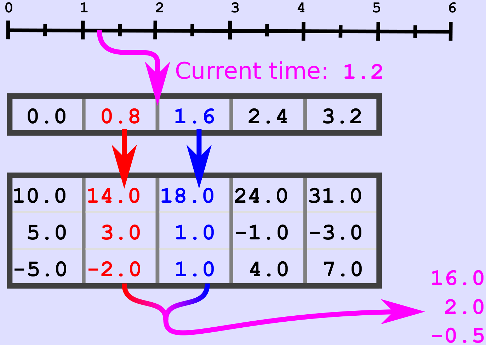

图中最上方的时间轴为全局时间，中间是动画采样器的输入（`input`）访问器，包含了关键帧的时间。下方是动画采样器的输出（`output`）访问器，包含动画属性的关键帧的数值。

采样器（`sampler`）在输入（`input`）数据中查找当前时间的关键帧。

读取输出（`output`）数据对应的值，并基于采样器的插值（`interpolation`）模式进行插值。

插值得到的值（图中的 16.0、2.0 和 -0.5）被转发到动画通道目标。

#### 动画通道目标（`Animation channel targets`）

来自于动画采样器的插值后的值会应用在不同动画通道目标中。

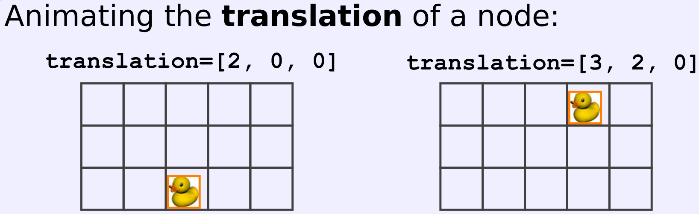

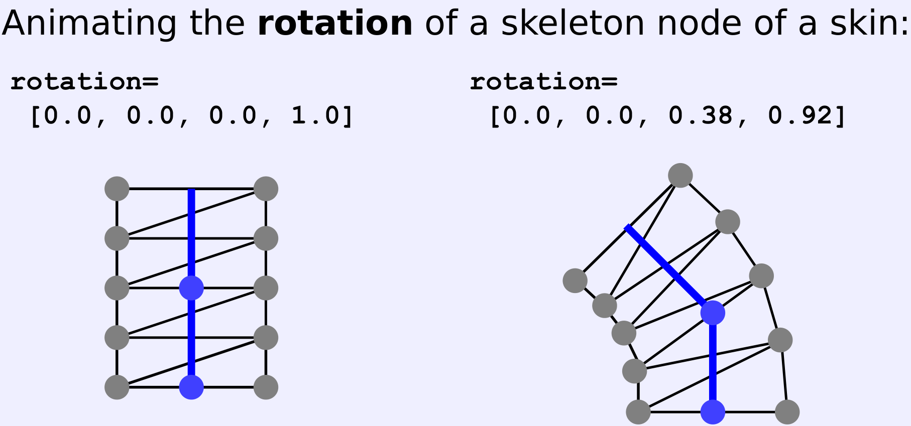

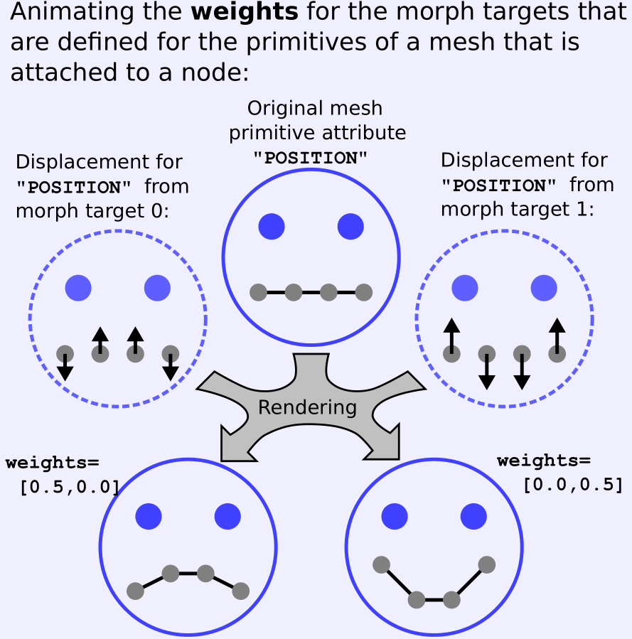

### 二进制 glTF 文件

在标准的 glTF 格式中，有两个选项可以包含外部二进制资源，如缓冲区数据和纹理：它们可以通过URI 引用，或者使用数据 URI 嵌入 glTF 的 JSON 部分。如果它们是通过 URI 引用的，那么每个外部资源都意味着一个新的下载请求。当它们被嵌入为数据 URI 时，二进制数据的 base64 编码将大大增加文件的大小。

为了克服这些缺点，我们可以选择将 glTF JSON 和二进制数据合并成一个单一的二进制 glTF 文件。这是一个小字节的文件，扩展名为 `.glb`。它包含一个头，提供关于数据的版本和结构的基本信息，以及一个或多个包含实际数据的块。第一个块总是包含 JSON 数据。其余的块包含二进制数据。

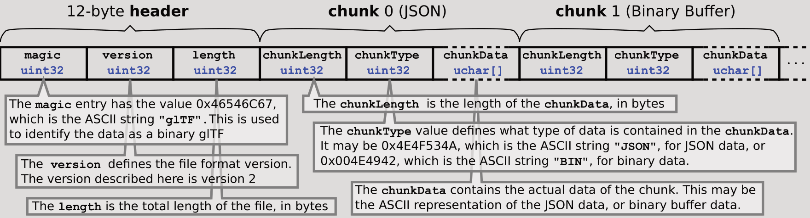

+ 12 字节的头：
  + `magic`：`uint32`，`0x46546C67`，为 `"glTF"` 的 ASCII 编码，用于确认数据是二进制 glTF
  + `version`：`uint32`，定义文件版本
  + `length`：`uint32`，文件的总字节数
+ 第 0 块（JSON）格式：
  + `chunkLength`：`uint32`，`chunkData` 的字节数
  + `chunkType`：`uint32`，定义了 `chunkData` 数据类型。可能是 `0x4E4F534A`，即`"JSON"` 的 ASCII 编码，对应 JSON 数据，或者是 `0x004E4942`，即 `"BIN"` 的 ASCII 编码，对应二进制数据
  + `chunkData`：`uchar[]` 包含实际数据，可能是由 ASCII 编码表示的 JSON 数据，或者是二进制数据

#### 扩展

glTF 格式允许扩展，添加新的函数功能，或者简化常用属性的定义。当扩展用于 glTF 资产，它被列在最顶层级的 `extensionsUsed` 属性中。`extensionsRequired` 属性罗列了保证加载资产的严格需要的扩展。
```JSON
"extensionsUsed" : [
    "KHR_lights_common",
    "CUSTOM_EXTENSION"
]
"extensionsRequired" : [
    "KHR_lights_common"
]
```

扩展允许在其它对象的 `extensions` 属性中添加任意对象。这些对象的名字与扩展中的名字相同，可能包含更深层的，由扩展确定的属性。
```JSON
"textures" : [
    {
        ...
        "extensions" : {
            "KHR_lights_common" : {
                "lightSource" : true,
        },
            "CUSTOM_EXTENSION" : {
                "customProperty" :
                    "customValue"
            }
        }
    }
]
```

#### 现有的扩展

在 Khronos 的 GitHub 存储库中开发和维护了几个扩展。完整的扩展列表可以在 [Khronos Extensions](https://github.com/KhronosGroup/glTF/tree/main/extensions/2.0) 中找到。以下扩展是由 Khronos 审批通过的官方扩展：
+ `KHR_draco_mesh_compression`：glTF 几何数据可以通过 Draco 三方库压缩
+ `KHR_lights_punctual`：添加对点光源、聚光和方向光源的支持
+ `KHR_materials_clearcoat`：允许对现有的 glTF PBR 材质添加一个透明图层
+ `KHR_materials_ior`：透明材质可以由折射率扩展而来
+ `KHR_materials_iridescene`：模拟薄膜效果，其色调取决于观察角度
+ `KHR_materials_sheen`：给由布料纤维引起的背面散射添加一个颜色参数
+ `KHR_materials_specular`：允许定义镜面反射的强度和颜色
+ `KHR_materials_transmission`：更真实地对反射、折射和透明度的建模
+ `KHR_materials_unlit`：允许定义 PBR 之外的材质
+ `KHR_materials_variants`：同一个几何上由多个材质，需要在运行时选择
+ `KHR_materials_volume`：对体积物体的厚度和衰减进行详细建模
+ `KHR_mesh_quantization`：用更小的数据类型更紧致地表示顶点属性
+ `KHR_mesh_basisu`：添加对使用 Basis Universal 超压缩的 KTX v2 图像的支持
+ `KHR_texture_transform`：支持对纹理的偏移、旋转和缩放，以踢创建纹理地图集
+ `KHR_xmp_json_ld`：添加对场景、节点、网格和其它 glTF 物体的 XMP 元数据支持